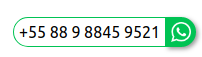

# WhatsAPP Button

Botão WhatsApp no site

# Demonstração

Você pode ver o widget funcionando aqui: [Demostração](https://lucianobragaweb.github.io)

# Instalação

A instalação mais simples é através do script em sua página web informando os parametros.

``
